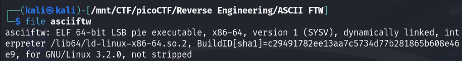
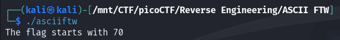
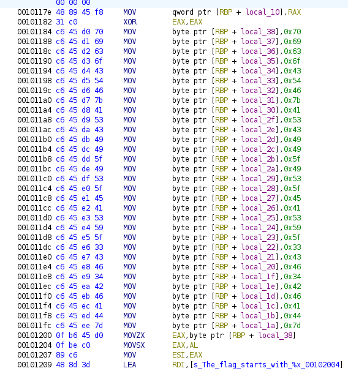

#### Description

This program has constructed the flag using hex ascii values. Identify the flag text by disassembling the program.  
You can download the file from [here](./asciiftw).

#### Write-up

First let's run the `file` command to check which type of file this is.  

We see that it's an executable file which is dynamically linked and it's not stripped.  
Let's give it proper permissions to run as executable using `chmod +x asciiftw` and try to run it.  

It says that the flag starts with 70 which is the `hex` representation of the ascii character `p`. As stated in the description that the program is using `hex` ascii values.

Let's open it in ghidra.  

We can see that before printing `The flag starts with 70` a bunch of variables with hex values are assigned and the first one is `0x70` which as the program says the first letter of the flag. Let's copy the values and use any hex to ascii converter to get the flag.

I have written [solver.py](./solver.py) to split and convert the flag from hex to ascii.

 
Flag

 picoCTF{ASCII_IS_EASY_3CF4BFAD}

