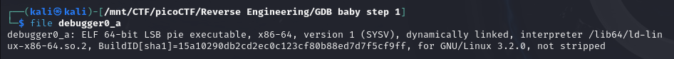
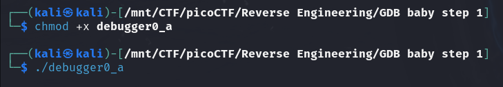
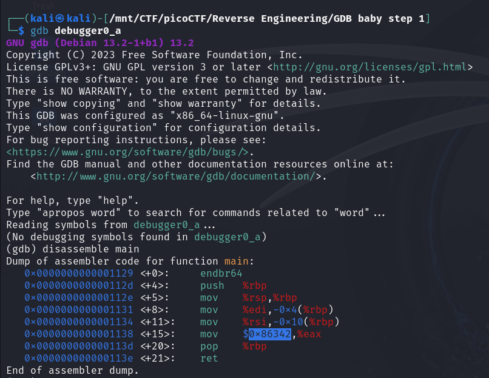

#### Description

Can you figure out what is in the `eax` register at the end of the `main` function? Put your answer in the picoCTF flag format: `picoCTF{n}` where n is the contents of the `eax` register in the decimal number base. If the answer was `0x11` your flag would be `picoCTF{17}`. Disassemble [this](./debugger0_a).

#### Write-up

First let's run the `file` command to check which type of file this is.

```bash
file debugger0_a
```



We see that it's an executable file which is dynamically linked and it's not stripped.

Let's give it proper permissions to run as executable using `chmod +x debugger0_a` and try to run it.

```bash
chmod +x debugger0_a
./debugger0_a
```


It shows no output.

Let's open it in `gdb` and disassemble the `main` function.

```bash
gdb debugger0_a
(gdb) disassemble main
```



We can see that `eax` contains the value `0x86342` after the `main` function. Let's convert it to decimal and it will be our flag.

<details>
 <summary>Flag</summary>
 picoCTF{549698}
</details>
