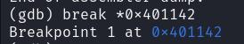

#### Description

Can you figure out what is in the `eax` register at the end of the `main` function? Put your answer in the picoCTF flag format: `picoCTF{n}` where n is the contents of the `eax` register in the decimal number base. If the answer was `0x11` your flag would be `picoCTF{17}`. Disassemble [this](./debugger0_b).

#### Write-up

First let's run the `file` command to check which type of file this is.

```bash
file debugger0_b
```


We see that it's an executable file which is dynamically linked and it's not stripped.

Let's give it proper permissions to run as executable using `chmod +x debugger0_b` and try to run it.

```bash
chmod +x debugger0_b
./debugger0_b
```


It shows no output.

Let's open it in `gdb` and disassemble the `main` function. We set the `disassembly-flavor` to `intel` syntax cause that's what most of us are comfortable with.

```bash
gdb debugger0_b
(gdb) set disassembly-flavor intel
(gdb) disassemble main
```


Now we can set a breakpoint at the `return address` of the `main` function to let it run till the end.

```bash
gdb debugger0_b
(gdb) set disassembly-flavor intel
(gdb) break *0x40112
```



Now we let the program run using the `run` command. When it breaks at the breakpoint, we will print the value stored in the `eax` register in decimal format.


<details>
 <summary>Flag</summary>
 picoCTF{307019}
</details>
