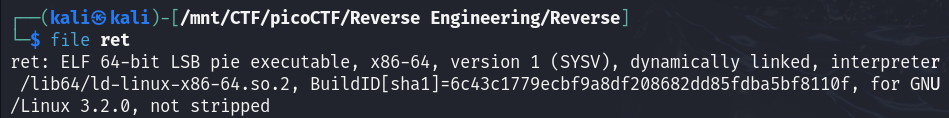
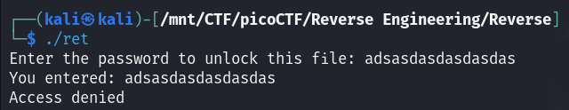
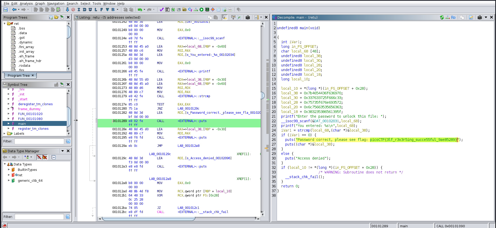
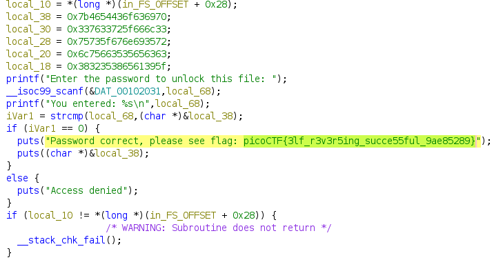

#### Description

Try reversing this file? Can ya?  
I forgot the password to this [file](./ret).  
Please find it for me?

#### Write-up

First let's run the `file` command to check which type of file this is.

We see that it's an executable file which is dynamically linked and it's not stripped.  
Let's give it proper permissions to run as executable using `chmod +x ret` and try to run it.

The program is asking for a password.

Let's open it in ghidra.  

In the main function we see the flag is given in the disassembled code.  

Also, if we look at the variables we see they are hex values and when they are combined and converted to ascii we get the flag in reverse order.

 
Flag

 picoCTF{3lf_r3v3r5ing_succe55ful_9ae85289}

