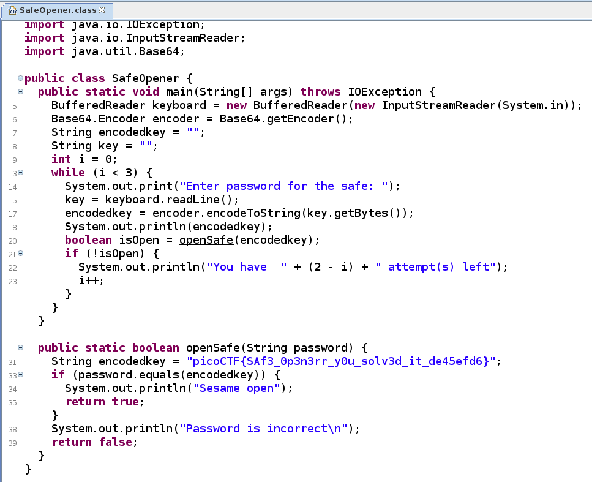

#### Description

What can you do with this file?  
I forgot the key to my safe but this [file](SafeOpener.class) is supposed to help me with retrieving the lost key. Can you help me unlock my safe?

#### Write-up

As we can see from the extension the given file is a compiled java file.  
We can use a java decompiler like `jd-gui` to decompile the class file.  
Opening the file in `jd-gui` we can see the flag is given in the code.

 
Flag

 picoCTF{ASCII_IS_EASY_3CF4BFAD}

