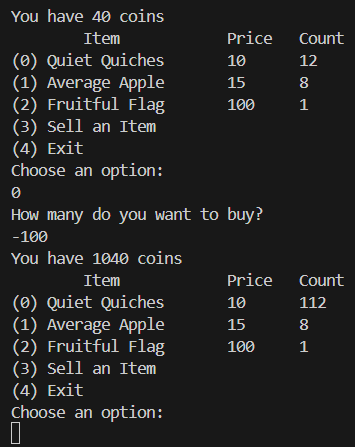

#### Description

Best Stuff - Cheap Stuff, Buy Buy Buy... Store Instance: [source](./source).  
The shop is open for business at `nc mercury.picoctf.net 10337`

#### Write-up

Running `nc mercury.picoctf.net 10337` command, we get a menu to buy some things. Among the items `Fruitful Flag` seems interesting.  
To buy the `Fruitful Flag` we need 100 coins. But we only have 40 coins. We also have 0 items in the inventory to sell.

Let's try buying something of a negative amount.



That seemed to have worked! We now have 1040 coins.  
Now we can buy the `Fruitful Flag`.
We get the following output.

```
Flag is:  [112 105 99 111 67 84 70 123 98 52 100 95 98 114 111 103 114 97 109 109 101 114 95 51 100 97 51 52 97 56 102 125]
```

These are decimal representations of ASCII characters. Putting them in [Cyberchef](https://gchq.github.io/CyberChef/) we get the flag.

<details>
 <summary>Flag</summary>
 `picoCTF{b4d_brogrammer_3da34a8f}`
</details>
