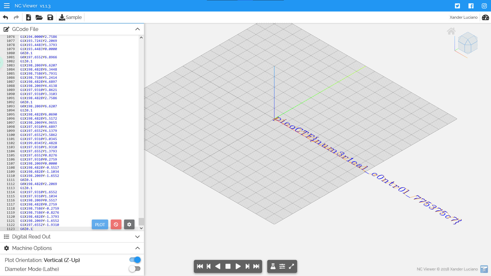

#### Description

There is something on my shop network running at `nc mercury.picoctf.net 53740`, but I can't tell what it is. Can you?

#### Write-up

Running `nc mercury.picoctf.net 53740` gives a lot of codes like the following.

```
G17 G21 G40 G90 G64 P0.003 F50
G0Z0.1
G0Z0.1
G0X0.8276Y3.8621
G1Z0.1
G1X0.8276Y-1.9310
G0Z0.1
G0X1.1034Y3.8621
G1Z0.1...
```

Upon Googling a bit, we can see that these are some types of code named `G-Code`. Searching for `G-Code interpreter` on Google, I've found [this website](https://ncviewer.com/).

Let's create a new file and paste the `G-Code` output from the `nc` command.

The flag is revealed!



<details>
 <summary>Flag</summary>
 picoCTF{num3r1cal_c0ntr0l_775375c7}
</details>
